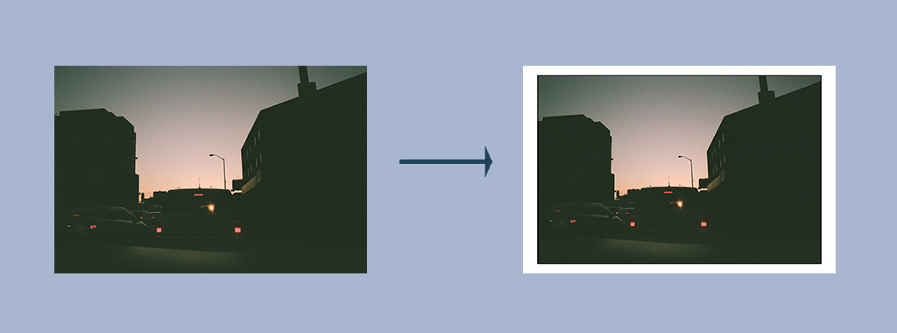

# Image Padder v1.0.0
'Image Padder' is a basic, lightweight Node-based image modifying script that allows for streamlining of 
custom image modifications, currently based in the basic terminal/shell CLI.
 
---

### ~ Backstory ~
I'm really into photography and unfortunately due to whatever subset of OCD that I have, I've always been
incredibly nitpicky about how I want my pictures to look. I've been shooting for about 4 years and, again,
I have a weirdly particular way I try to frame and compose my photos before I post them/use them for
whatever. The issue is that from the scans to the final product, I've always had to manually reformat 
the images and apply the border styling that I've re-developed over and over again. This entire process
can really soak up my time and takes away from the enjoyment of using the pictures for whatever purpose. 
As such, I decided to streamline the process the best way I know how; **scripting it**. And so here 
we are today. 

---

### ~ Description and Functionality ~
The script itself is a simple executable JS file, run through NodeJS and with a very minor set of 
libraries. 
*   Since manual pixel manipulation via JS is a little tricky, at least at the moment for me, 
    without a DOM, I resorted to using GraphikMagik and all accompanying dependencies for the 
    manual image manipulation. 
*   There are two possible streams of input; a single image, or directory/folder of images. Both are 
    passed in as an inline command argument and are parsed and validated accordingly, before the
    image modifications take place. 
*   Once the input has been validated, the script uses calculated values (based on personal visual 
    preferences) to apply corresponding border style changes to the image and rewrites it as required. 

---

### ~ Execution ~
*   To run the script, ensure you have 'ImageMagik' and 'GraphikMagik' installed locally first (brew, ports, etc).
*   Install required dependencies: `npm i`
*   Run the script: `node cli.js /path/to/image.jpg`
*   The original image should now be processed and edited, as required. 
*   Example: running `node cli.js /assets/test/city.jpg` produces the following changes

---

### ~ Status and Incoming Changes ~ 
As it stands, the script is static; it applies the same styling to every image: a thin black border, 
followed by a major white wrapping border. For the time being, there is no other processing that will
take place. Again, the scope of this project is to allow for a streamline of image very trivial image 
editing to occur, and it is not meant to act as a fully fledged image processing/editing software. 

That being said, some future changes include:
*   Secondary edit pass; allow for a square-ing of images (will provide imagery to describe visually).
*   Further developer CLI for narrowing down some custom changes, as well as recursion for rejected input.
*   Potential deployment and hosting (escapes the scope of the project however).
*   Dynamic naming convention for file changes. 

